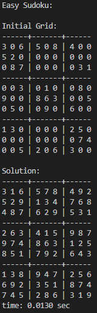
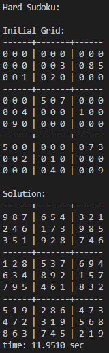
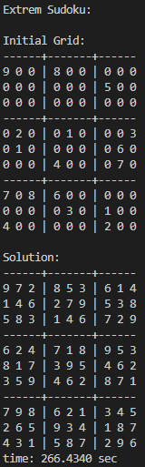

# Sudoku Solver

A simple C program to solve sudoku puzzles using backtracking. The program takes a text file as input and outputs the solved puzzle to the console. The input file should look something like this, where the empty cells are represented by 0s:

```shell
3, 0, 6, 5, 0, 8, 4, 0, 0, 
5, 2, 0, 0, 0, 0, 0, 0, 0, 
0, 8, 7, 0, 0, 0, 0, 3, 1, 
0, 0, 3, 0, 1, 0, 0, 8, 0,
9, 0, 0, 8, 6, 3, 0, 0, 5,
0, 5, 0, 0, 9, 0, 6, 0, 0, 
1, 3, 0, 0, 0, 0, 2, 5, 0,
0, 0, 0, 0, 0, 0, 0, 7, 4,
0, 0, 5, 2, 0, 6, 3, 0, 0
```

Compile the program:
```shell
gcc sudoku.c -o sudoku 
```
Run the program:
```shell
./sudoku.exe
```

For demonstration purposes, I have included three text files as input. The algorithm's execution time varies based on the complexity of the Sudoku puzzles, with puzzles that require more extensive backtracking taking significantly longer to solve. The output for the tests looks like this:



